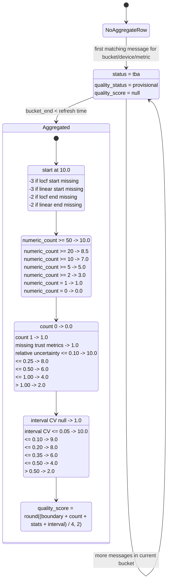

# Aggregate Status And Quality

This project stores retained aggregate buckets in:

- `mqtt_ingest.message_3m_aggregates`
- `mqtt_ingest.message_15m_aggregates`
- `mqtt_ingest.message_60m_aggregates`
- `mqtt_ingest.message_24h_aggregates`

Each row carries two different assessments:

- `status`: technical bucket lifecycle
- `quality_*`: analytical trust assessment for retained aggregate data

Those are intentionally separate. A row can be technically complete enough to be `aggregated` while still having reduced analytical quality because boundary context is missing or the bucket is based on very few numeric samples.

## Status Fields

Technical bucket state:

- `tba`: the bucket has started but the bucket end is still in the future at the last refresh
- `aggregated`: the bucket end is in the past at the last refresh

Analytical quality state:

- `quality_status = 'provisional'`: open bucket, not scored yet
- `quality_status = 'rated'`: completed bucket, quality score has been derived

The implementation currently maps them like this:

- `status = 'tba'` -> `quality_status = 'provisional'`
- `status = 'aggregated'` -> `quality_status = 'rated'`

## Mermaid Statechart



## What Influences `status`

`status` is purely technical and time-based.

- A bucket is `tba` while `bucket_end` is not yet in the past.
- A bucket becomes `aggregated` once `bucket_end` is in the past at refresh time.
- The ingest function refreshes touched buckets immediately, so active buckets appear quickly as `tba`.
- Background refresh jobs re-run the aggregate functions so completed buckets move from `tba` to `aggregated`.

`status` does not directly care about:

- how many numeric values were inside the bucket
- whether interpolation was possible at bucket boundaries
- whether the average has tight or wide confidence bounds

Those concerns are handled by the quality fields instead.

## What Influences `quality_score`

`quality_score` is only calculated for completed buckets with `status = 'aggregated'`.

For open buckets:

- `quality_status = 'provisional'`
- `quality_score = NULL`
- quality sub-scores are `NULL`
- `quality_flags = NULL`

For completed buckets:

- `quality_status = 'rated'`
- quality is the average of four explainable sub-scores

### 1. Boundary completeness

`quality_boundary_score` starts at `10.0` and is reduced when bucket boundary context is missing:

- `-3.0` if `locf_value_at_bucket_start` is `NULL`
- `-3.0` if `linear_value_at_bucket_start` is `NULL`
- `-2.0` if `locf_value_at_bucket_end` is `NULL`
- `-2.0` if `linear_value_at_bucket_end` is `NULL`

The score is clamped to `0.0`.

This makes missing pre-bucket context materially visible. If the value at bucket start is unknown, the retained bucket is less trustworthy once the raw history is gone.

### 2. Numeric sample volume

`quality_count_score` depends only on `numeric_count`:

| `numeric_count` | `quality_count_score` |
| --- | --- |
| `>= 50` | `10.0` |
| `>= 20` | `8.5` |
| `>= 10` | `7.0` |
| `>= 5` | `5.0` |
| `>= 2` | `3.0` |
| `= 1` | `1.0` |
| `= 0` | `0.0` |

This is the direct answer to the "5 values versus 500 values" problem. Buckets backed by more numeric observations score higher, even if their averages are similar.

### 3. Statistical certainty

`quality_stats_score` uses the stored trust metrics, mainly the 95% confidence interval width relative to the bucket's own scale.

Internal scale reference:

- `abs(numeric_avg)`
- `abs(numeric_median)`
- `abs(numeric_p75 - numeric_p25)`
- `abs(numeric_max - numeric_min)`
- fallback `1.0`

Relative uncertainty is derived as:

```text
(numeric_ci95_upper - numeric_ci95_lower) / scale_reference
```

Score thresholds:

| Condition | `quality_stats_score` |
| --- | --- |
| `numeric_count = 0` | `0.0` |
| `numeric_count = 1` | `1.0` |
| trust metrics unavailable | `1.0` |
| relative uncertainty `<= 0.10` | `10.0` |
| relative uncertainty `<= 0.25` | `8.0` |
| relative uncertainty `<= 0.50` | `6.0` |
| relative uncertainty `<= 1.00` | `4.0` |
| relative uncertainty `> 1.00` | `2.0` |

This means a bucket with many samples but a very wide confidence interval can still be penalized.

### 4. Measurement interval regularity

`quality_interval_score` uses boundary-inclusive spacing between successive timestamps:

- bucket start if start boundary support exists
- raw numeric sample timestamps inside the bucket
- bucket end if end boundary support exists

Derived interval fields:

- `interval_gap_count`
- `interval_gap_avg_seconds`
- `interval_gap_stddev_seconds`
- `interval_gap_cv`

The retained regularity metric is:

```text
interval_gap_cv = interval_gap_stddev_seconds / interval_gap_avg_seconds
```

Score thresholds:

| Condition | `quality_interval_score` |
| --- | --- |
| interval metric unavailable | `1.0` |
| interval gap CV `<= 0.05` | `10.0` |
| interval gap CV `<= 0.10` | `9.0` |
| interval gap CV `<= 0.20` | `8.0` |
| interval gap CV `<= 0.35` | `6.0` |
| interval gap CV `<= 0.50` | `4.0` |
| interval gap CV `> 0.50` | `2.0` |

Lower coefficient of variation means more equal spacing and better retained temporal coverage.

## Final Score

For completed buckets:

```text
quality_score = round(
  (
    quality_boundary_score
    + quality_count_score
    + quality_stats_score
    + quality_interval_score
  ) / 4,
  2
)
```

Range:

- minimum `0.0`
- maximum `10.0`

Interpretation:

- `8-10`: strong retained bucket quality
- `5-8`: usable but with notable limitations
- `2-5`: weak retained summary, inspect flags and sample volume
- `0-2`: very poor retained quality or almost no useful numeric support

These bands are descriptive guidance, not hard database states.

## Quality Flags

`quality_flags` explain why a bucket lost score:

- `missing_locf_start`
- `missing_linear_start`
- `missing_locf_end`
- `missing_linear_end`
- `low_numeric_count`
- `single_numeric_sample`
- `high_mean_uncertainty`
- `insufficient_interval_support`
- `irregular_measurement_intervals`

Typical interpretations:

- `missing_*_start`: no usable pre-bucket boundary support existed
- `missing_*_end`: completed bucket still lacked enough post-boundary context
- `low_numeric_count`: fewer than 5 numeric values contributed
- `single_numeric_sample`: exactly one numeric value contributed
- `high_mean_uncertainty`: the 95% confidence interval is wide relative to the bucket's scale
- `insufficient_interval_support`: completed bucket did not have enough usable spacing gaps for a meaningful interval-regularity metric
- `irregular_measurement_intervals`: measurement spacing was materially uneven across the boundary-inclusive bucket timeline

## Reading The Fields Together

Recommended order when judging a retained bucket:

1. Check `status`.
2. Check `quality_status`.
3. Check `quality_score`.
4. Check `quality_flags`.
5. Check `numeric_count`, `numeric_stderr`, and `numeric_ci95_*`.
6. Check `interval_gap_cv` and `quality_interval_score` for spacing regularity.
7. Check `numeric_median`, `numeric_p25`, and `numeric_p75` for skew or spread.

Examples:

- `status = 'tba'` with `quality_status = 'provisional'`: active bucket, do not treat the score as final.
- `status = 'aggregated'` and `quality_score = 9.2`: completed bucket with good boundary support, strong sample count, and narrow uncertainty.
- `status = 'aggregated'`, `quality_score = 3.1`, `quality_flags = {missing_locf_start,low_numeric_count,irregular_measurement_intervals}`: completed bucket exists, but retained quality is weak.

## Practical Guidance

When raw data retention is shorter than aggregate retention:

- use `numeric_count` to understand how much direct evidence supports a bucket
- use `quality_flags` to spot missing boundary context
- use `numeric_ci95_lower` and `numeric_ci95_upper` to understand mean uncertainty
- use `interval_gap_cv` to understand how evenly measurements were distributed over the bucket
- use `numeric_median`, `numeric_p25`, and `numeric_p75` to understand the typical value and spread
- use `quality_score` as a compact summary, not as the only signal

If you need stricter downstream filtering, a common pattern is to keep the row but ignore it analytically when:

- `quality_status <> 'rated'`
- `quality_score < 5.0`
- `numeric_count < 5`
- `quality_flags` contains boundary-missing flags
