# Ingest Pipeline

This document describes the local end-to-end path from MQTT publication to PostgreSQL/TimescaleDB storage.

The SQL objects described here are maintained in the standalone SQL submodule checkout at `examples/sql/mqtt-ingest`.

For a more structural description with Mermaid class and sequence diagrams, see [System architecture](system-architecture.md).

The local stack has two subscriber paths:

- `mqtt-subscriber`: handles sensor-message ingest and aggregate refresh
- `mqtt-subscriber-topics`: handles broker-wide topic inventory ingest

## Mermaid Flowchart

```mermaid
flowchart TD
    Publisher["mqtt-publisher\nJSON-configured topic publishers"]
    Broker["mqtt-broker\nMosquitto"]

    SensorSubscriber["mqtt-subscriber\n/config/subscriber-config.json"]
    TopicSubscriber["mqtt-subscriber-topics\n/config/subscriber-topics-config.json"]

    SensorFilters["topic filters\nfor example sensors/+/temp\nand sensors/+/humidity"]
    TopicFilters["topic filters\n# and $SYS/#"]

    IngestMessage["mqtt_ingest.ingest_message(...)"]
    IngestTopics["mqtt_ingest.ingest_topics(...)"]

    Messages["mqtt_ingest.messages\nraw hypertable"]
    TopicOverview["mqtt_ingest.topic_overview\ntopic inventory table"]

    Refresh3m["refresh_message_3m_aggregates(...)"]
    Refresh15m["refresh_message_15m_aggregates(...)"]
    Refresh60m["refresh_message_60m_aggregates(...)"]
    Refresh24h["refresh_message_24h_aggregates(...)"]
    Recon3m["refresh_power_energy_3m_reconciliation(...)"]
    Recon15m["refresh_power_energy_15m_reconciliation(...)"]
    Recon60m["refresh_power_energy_60m_reconciliation(...)"]
    Recon24h["refresh_power_energy_24h_reconciliation(...)"]

    Agg3m["mqtt_ingest.message_3m_aggregates"]
    Agg15m["mqtt_ingest.message_15m_aggregates"]
    Agg60m["mqtt_ingest.message_60m_aggregates"]
    Agg24h["mqtt_ingest.message_24h_aggregates"]
    PowerEnergy3m["mqtt_ingest.power_energy_3m_reconciliation"]
    PowerEnergy15m["mqtt_ingest.power_energy_15m_reconciliation"]
    PowerEnergy60m["mqtt_ingest.power_energy_60m_reconciliation"]
    PowerEnergy24h["mqtt_ingest.power_energy_24h_reconciliation"]

    Jobs["TimescaleDB background jobs\nrun once per minute"]

    Publisher --> Broker
    Broker --> SensorSubscriber
    Broker --> TopicSubscriber

    SensorSubscriber --> SensorFilters
    TopicSubscriber --> TopicFilters

    SensorFilters --> IngestMessage
    TopicFilters --> IngestTopics

    IngestMessage --> Messages
    IngestTopics --> TopicOverview

    IngestMessage --> Refresh3m
    IngestMessage --> Refresh15m
    IngestMessage --> Refresh60m
    IngestMessage --> Refresh24h
    IngestMessage --> Recon3m
    IngestMessage --> Recon15m
    IngestMessage --> Recon60m
    IngestMessage --> Recon24h

    Refresh3m --> Agg3m
    Refresh15m --> Agg15m
    Refresh60m --> Agg60m
    Refresh24h --> Agg24h
    Recon3m --> PowerEnergy3m
    Recon15m --> PowerEnergy15m
    Recon60m --> PowerEnergy60m
    Recon24h --> PowerEnergy24h

    Jobs --> Refresh3m
    Jobs --> Refresh15m
    Jobs --> Refresh60m
    Jobs --> Refresh24h
    Jobs --> Recon3m
    Jobs --> Recon15m
    Jobs --> Recon60m
    Jobs --> Recon24h
```

## Sensor Ingest Path

The sensor subscriber is the data path used for retained raw messages and stored aggregates.

1. `mqtt-publisher` publishes MQTT messages to `mqtt-broker`.
2. `mqtt-subscriber` subscribes to the configured sensor topic filters.
3. Each matching message is passed to `mqtt_ingest.ingest_message(...)`.
4. `mqtt_ingest.ingest_message(...)` writes one raw row into `mqtt_ingest.messages`.
5. The same ingest function immediately refreshes the touched:
   - `message_3m_aggregates`
   - `message_15m_aggregates`
   - `message_60m_aggregates`
   - `message_24h_aggregates`
   - `power_energy_3m_reconciliation`
   - `power_energy_15m_reconciliation`
   - `power_energy_60m_reconciliation`
   - `power_energy_24h_reconciliation`

This means the raw hypertable is the primary source, and the aggregate tables are derived from it.

For `power` and `energy` topics, the raw hypertable is also the source of a separate per-device reconciliation path that compares integrated `power` against cumulative `energy` deltas.

## Topic Overview Path

The topic-overview subscriber is separate on purpose.

1. `mqtt-subscriber-topics` subscribes broadly to `#` and `$SYS/#`.
2. Each matching message is passed to `mqtt_ingest.ingest_topics(...)`.
3. `mqtt_ingest.ingest_topics(...)` upserts one row per distinct topic into `mqtt_ingest.topic_overview`.

This path is for broker visibility, not time-series aggregation.

## What `ingest_message(...)` Does

For each incoming message, `mqtt_ingest.ingest_message(...)`:

- stores the original topic and payload
- extracts `numeric_value` when possible
- stores trace metadata when present
- parses `device_id` and `metric_name` for topics that match exactly `sensors/<device>/<metric>`
- refreshes all four aggregate widths for the touched time range

Only rows with parsed `device_id` and `metric_name` participate in the device-level aggregate tables.

## Raw Table And Derived Tables

`mqtt_ingest.messages` is the source table for:

- raw message history
- numeric statistics
- boundary interpolation lookups
- time-weighted averages
- interval-regularity quality

Derived tables:

- `mqtt_ingest.message_3m_aggregates`
- `mqtt_ingest.message_15m_aggregates`
- `mqtt_ingest.message_60m_aggregates`
- `mqtt_ingest.message_24h_aggregates`
- `mqtt_ingest.power_energy_3m_reconciliation`
- `mqtt_ingest.power_energy_15m_reconciliation`
- `mqtt_ingest.power_energy_60m_reconciliation`
- `mqtt_ingest.power_energy_24h_reconciliation`

Each aggregate row is grouped by:

- `bucket_start`
- `device_id`
- `metric_name`

The full `topic` is still retained on the aggregate row for traceability.

## Immediate Refresh Vs Background Refresh

There are two refresh mechanisms for aggregates:

- immediate refresh inside `mqtt_ingest.ingest_message(...)`
- periodic refresh from TimescaleDB background jobs

Immediate refresh:

- makes the currently active bucket appear right away
- typically leaves that row in `status = 'tba'` until the bucket has fully ended

Background refresh:

- reruns each aggregate function once per minute
- moves completed buckets from `tba` to `aggregated`
- ensures boundary-aware and quality fields are revisited as more surrounding samples become available

## Practical Reading Order

When tracing one published sensor message through the system:

1. confirm it was published to the broker
2. confirm the sensor subscriber has a matching topic filter
3. confirm `mqtt_ingest.messages` contains the raw row
4. confirm parsed `device_id` and `metric_name` if the topic matches `sensors/<device>/<metric>`
5. inspect the matching aggregate tables for the relevant bucket widths
6. inspect `status`, `quality_status`, and `quality_score` on the aggregate rows

For broker-wide visibility rather than aggregates:

1. inspect `mqtt_ingest.topic_overview`
2. confirm the topic-overview subscriber is subscribed to `#` and `$SYS/#`
