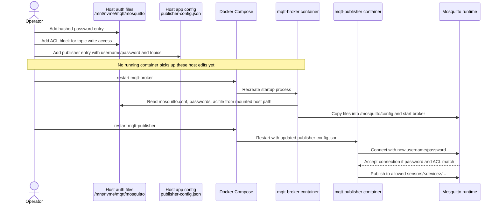

# Secure Broker How-To

This guide covers the local secure Mosquitto setup in `examples/local-stack/` and how to add new publishers or subscribers with per-client credentials and ACLs.

It focuses on two workflows:

- adding clients before the first startup
- adding or changing clients while the broker stack is already running

## Current Local Layout

The secure broker setup is driven by these files:

- `examples/local-stack/publisher-config.json`
- `examples/local-stack/subscriber-config.json`
- `examples/local-stack/subscriber-topics-config.json`
- `/mnt/nvme/mqtt/mosquitto/mosquitto.conf`
- `/mnt/nvme/mqtt/mosquitto/passwords`
- `/mnt/nvme/mqtt/mosquitto/aclfile`
- `examples/local-stack/docker-compose.yml`

Important behavior:

- the Compose service name inside Docker is still `mqtt-broker`
- host or LAN clients can use `mqtt.pi5.local` if Technitium resolves that name to the Docker host IP
- the live broker config source on the host is `/mnt/nvme/mqtt/mosquitto`
- the broker container copies `mosquitto.conf`, `passwords`, and `aclfile` from `/mosquitto/config-src` into `/mosquitto/config` at startup
- because of that copy step, edits to `/mnt/nvme/mqtt/mosquitto/passwords` or `aclfile` only take effect after restarting the `mqtt-broker` container
- the bind mount is read-only, so changes made inside the running container do not persist back to the host
- for this setup, the host files under `/mnt/nvme/mqtt/mosquitto` are the only persistent source of truth

If you want to keep a repo-local template copy, treat `examples/local-stack/mosquitto/` as reference material only. It is no longer the mounted runtime source for the broker.

## Read-Only Mount Rule

The broker mount is intentionally `:ro`.

That means:

- add or change usernames and password hashes on the host
- add or change ACL rules on the host
- restart the broker so it reloads the copied files

Do not use the running container as the place where you maintain broker users.

In practice, avoid workflows like:

- editing `/mosquitto/config/passwords` inside the running container
- editing `/mosquitto/config/aclfile` inside the running container
- assuming `docker compose build` alone will reload broker auth data

Those changes are either impossible because of the read-only source mount, or temporary because the live container filesystem is replaced on recreate.

## Safe Username/Password Workflow

Use this sequence whenever you add a new MQTT account.

1. Edit `/mnt/nvme/mqtt/mosquitto/passwords` on the host
2. Edit `/mnt/nvme/mqtt/mosquitto/aclfile` on the host
3. Edit the matching app config on the host
4. Restart `mqtt-broker`
5. Restart the affected publisher or subscriber service

For a publisher, the matching app config is usually:

- `examples/local-stack/publisher-config.json`

For the ingest subscriber:

- `examples/local-stack/subscriber-config.json`

For the topic-overview subscriber:

- `examples/local-stack/subscriber-topics-config.json`

## Sequence Diagram: Add One Publisher

This diagram shows the safe flow for adding one new publisher account in the current read-only mount design.



## Safe Restart Pattern

After editing host-side broker auth files, use:

```bash
docker compose -f examples/local-stack/docker-compose.yml restart mqtt-broker
```

Then restart any service whose credentials or topic scope changed.

Example:

```bash
docker compose -f examples/local-stack/docker-compose.yml restart mqtt-publisher
docker compose -f examples/local-stack/docker-compose.yml restart mqtt-subscriber
```

If you only changed publisher credentials, you do not need to restart TimescaleDB.

## What Not To Do

- do not add users only inside the container
- do not edit only the repo copy under `examples/local-stack/mosquitto/` and expect the running broker to use it
- do not restart only `mqtt-publisher` after changing broker passwords or ACLs
- do not assume a running broker will notice host-side auth file edits without a restart

## Quick Rules

- every publisher should get its own MQTT username and password
- every publisher should get a write-only ACL for its own topic namespace
- every long-running subscriber should get its own MQTT username and password
- subscribers should only get the read ACLs they actually need
- adding a publisher usually means updating three things:
  - `publisher-config.json`
  - `/mnt/nvme/mqtt/mosquitto/passwords`
  - `/mnt/nvme/mqtt/mosquitto/aclfile`

## Add Publishers On Initial Startup

Use this path when the stack is not running yet, or when you are preparing the next clean startup.

### 1. Add the publisher credentials

Append a new line in `/mnt/nvme/mqtt/mosquitto/passwords`.

Follow the existing format:

```text
publisher-node-4:<hashed-password>
```

Do not store plain-text passwords in this file. It must contain Mosquitto password hashes like the existing entries.

To hash one password with the Mosquitto container tooling, use:

```bash
docker run --rm eclipse-mosquitto:2 \
  sh -c 'mosquitto_passwd -b /tmp/passwords publisher-node-4 publisher-node-4-secret && cat /tmp/passwords'
```

This prints one `username:hash` line that you can copy into `/mnt/nvme/mqtt/mosquitto/passwords`.

If you want to generate a new hash with the same method used in this repo:

```bash
docker run --rm -v /tmp:/work eclipse-mosquitto:2 \
  sh -c 'rm -f /work/mqtt2postgres-mosquitto.passwd && \
  mosquitto_passwd -b -c /work/mqtt2postgres-mosquitto.passwd publisher-node-4 publisher-node-4-secret && \
  cat /work/mqtt2postgres-mosquitto.passwd'
```

Copy the generated line into `/mnt/nvme/mqtt/mosquitto/passwords`.

### 2. Add the publisher ACL

Append a new block in `/mnt/nvme/mqtt/mosquitto/aclfile`.

Example:

```text
user publisher-node-4
topic write sensors/node-4/#
```

This lets that account publish only under `sensors/node-4/...`.

### 3. Add the publisher runtime entry

Append a new object to `examples/local-stack/publisher-config.json`.

Example:

```json
{
  "host": "mqtt-broker",
  "port": 1883,
  "mqtt_username": "publisher-node-4",
  "mqtt_password": "publisher-node-4-secret",
  "client_id": "publisher-node-4",
  "publisher_id": "node-4-sim",
  "qos": 0,
  "payload_format": "json",
  "frequency_seconds": 1,
  "topics": [
    {
      "topic": "sensors/node-4/temp",
      "generator": {
        "kind": "clipped_normal",
        "mean": 21,
        "stddev": 1.2,
        "min_value": 18,
        "max_value": 24,
        "seed": 101
      }
    },
    {
      "topic": "sensors/node-4/humidity",
      "generator": {
        "kind": "uniform",
        "min_value": 35,
        "max_value": 55,
        "seed": 102
      }
    }
  ]
}
```

### 4. Make sure the ingest subscriber can read the new topics

If the new publisher stays under topic patterns already covered by `subscriber-config.json`, no change is needed.

For the default local config, these patterns are already covered:

- `sensors/+/temp`
- `sensors/+/humidity`
- `sensors/+/power`
- `sensors/+/energy`

If you introduce a new metric such as `pressure`, add it to:

- `examples/local-stack/subscriber-config.json`
- `/mnt/nvme/mqtt/mosquitto/aclfile` under `user subscriber-ingest`

Example:

```text
user subscriber-ingest
topic read sensors/+/pressure
```

### 5. Start the stack

```bash
docker compose -f examples/local-stack/docker-compose.yml up --build
```

## Add Publishers While The Broker Is Running

This is the safe operational path for the current repo setup.

### What must be restarted

- restart `mqtt-broker` after changing `passwords`, `aclfile`, or `mosquitto.conf`
- restart `mqtt-publisher` after changing `publisher-config.json`
- restart `mqtt-subscriber` if you changed `subscriber-config.json`
- restart `mqtt-subscriber-topics` if you changed `subscriber-topics-config.json`

The running broker does not automatically consume edits from `/mnt/nvme/mqtt/mosquitto/` because those files are copied into the live config directory only during broker startup.

### Recommended sequence

1. Edit `/mnt/nvme/mqtt/mosquitto/passwords`
2. Edit `/mnt/nvme/mqtt/mosquitto/aclfile`
3. Edit `examples/local-stack/publisher-config.json`
4. Restart the broker
5. Restart the publisher container
6. Restart subscribers if their topic coverage changed

Example commands:

```bash
docker compose -f examples/local-stack/docker-compose.yml restart mqtt-broker
docker compose -f examples/local-stack/docker-compose.yml restart mqtt-publisher
```

If you changed the ingest subscriber topic filters:

```bash
docker compose -f examples/local-stack/docker-compose.yml restart mqtt-subscriber
```

If you changed the topic-overview subscriber:

```bash
docker compose -f examples/local-stack/docker-compose.yml restart mqtt-subscriber-topics
```

### When a full reset is better

Use a full teardown instead of service restarts when:

- you changed SQL bootstrap files
- you want a clean database state
- you want to rerun startup from a known empty environment

```bash
./scripts/dev/stop-local-test-stack.sh
docker compose -f examples/local-stack/docker-compose.yml up --build
```

## Add Multiple Publishers At Once

The cleanest pattern is one publisher account per device or logical simulator.

For five new device simulators:

1. add five hashed entries in `/mnt/nvme/mqtt/mosquitto/passwords`
2. add five ACL blocks in `/mnt/nvme/mqtt/mosquitto/aclfile`
3. add five publisher entries in `publisher-config.json`
4. restart `mqtt-broker`
5. restart `mqtt-publisher`

Keep each publisher aligned like this:

- MQTT username: `publisher-node-7`
- client id: `publisher-node-7`
- publisher id: `node-7-sim`
- ACL topic root: `sensors/node-7/#`

That convention makes ACL review and troubleshooting much easier.

## Add A New Metric For Existing Publishers

Example: add `sensors/node-1/pressure`.

### Needed changes

- in `publisher-config.json`, add a new topic entry under the existing `publisher-node-1`
- in `subscriber-config.json`, add `sensors/+/pressure`
- in `/mnt/nvme/mqtt/mosquitto/aclfile`, add `topic read sensors/+/pressure` under `user subscriber-ingest`

### Not needed

- no new publisher account is required if the publisher stays in the same device namespace
- no new publisher ACL block is required if `topic write sensors/node-1/#` already covers the new metric

### Restart sequence

```bash
docker compose -f examples/local-stack/docker-compose.yml restart mqtt-broker
docker compose -f examples/local-stack/docker-compose.yml restart mqtt-subscriber
docker compose -f examples/local-stack/docker-compose.yml restart mqtt-publisher
```

## Add A New Subscriber

There are two common cases.

### 1. Another ingest-style subscriber

Use this when a new long-running consumer should read only a restricted set of sensor topics.

Steps:

1. add a new hashed entry in `/mnt/nvme/mqtt/mosquitto/passwords`
2. add a new `user ...` block in `/mnt/nvme/mqtt/mosquitto/aclfile` with only the read patterns that subscriber needs
3. create a new JSON config based on `examples/local-stack/subscriber-config.json`
4. run it either on the host or as another Compose service
5. restart `mqtt-broker`

Example ACL:

```text
user subscriber-temp-only
topic read sensors/+/temp
```

### 2. Another overview or admin-style subscriber

Use this when the subscriber needs broad visibility.

Example ACL:

```text
user subscriber-admin
topic read #
topic read $SYS/#
```

Be conservative here. Broad read access should be the exception, not the default.

## Host-Run One-Off Publishers

For manual testing against the running local broker from the host:

```bash
python examples/publish_random.local.py \
  --host mqtt.pi5.local \
  --port 1883 \
  --mqtt-username publisher-node-4 \
  --mqtt-password publisher-node-4-secret \
  --topic sensors/node-4/temp \
  --min-value 18 \
  --max-value 24 \
  --frequency-seconds 1 \
  --count 5
```

If Technitium DNS is not in place yet, use `127.0.0.1` instead of `mqtt.pi5.local`.

## Validation Checklist

After adding or changing clients, verify:

- `docker compose -f examples/local-stack/docker-compose.yml logs -f mqtt-broker`
- `docker compose -f examples/local-stack/docker-compose.yml logs -f mqtt-publisher`
- `docker compose -f examples/local-stack/docker-compose.yml logs -f mqtt-subscriber`
- `./scripts/dev/query-local-topic-overview.sh`
- `./scripts/dev/query-local-sensor-temp.sh`

For auth and ACL regression coverage, run:

```bash
./scripts/dev/run-secure-local-smoke-test.sh
```

If DNS is not ready yet:

```bash
MQTT_HOST=127.0.0.1 ./scripts/dev/run-secure-local-smoke-test.sh
```

## Common Mistakes

- adding a publisher to `publisher-config.json` but forgetting to add the broker password entry in `/mnt/nvme/mqtt/mosquitto/passwords`
- adding the password entry but forgetting the ACL block in `/mnt/nvme/mqtt/mosquitto/aclfile`
- adding a new metric without extending the ingest subscriber read ACL
- editing `/mnt/nvme/mqtt/mosquitto/passwords` or `aclfile` and restarting only `mqtt-publisher`
- using `mqtt.pi5.local` inside Docker configs instead of `mqtt-broker`
- reusing one publisher account for multiple unrelated device namespaces
