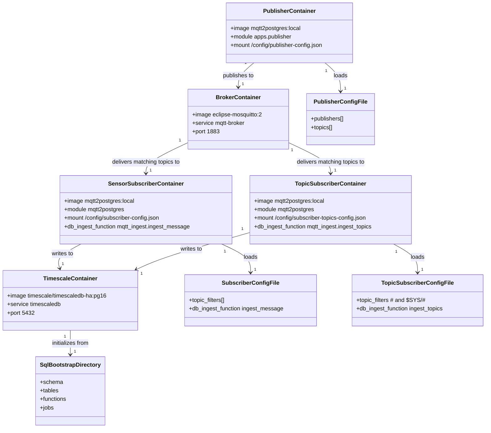
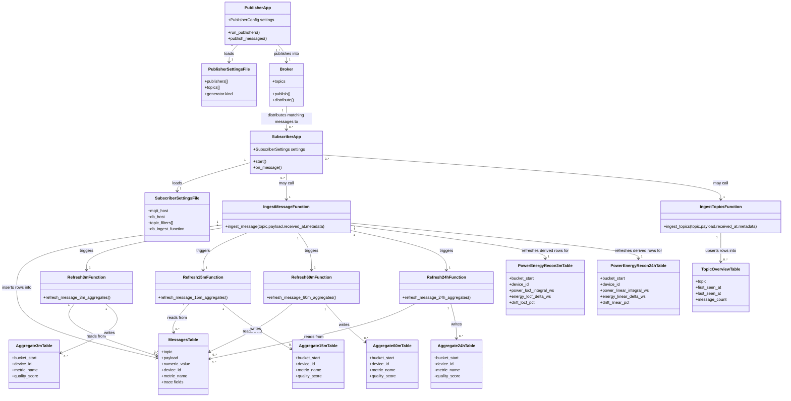
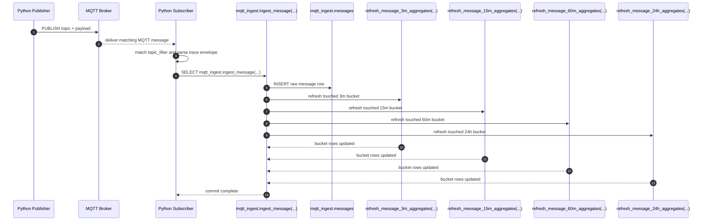
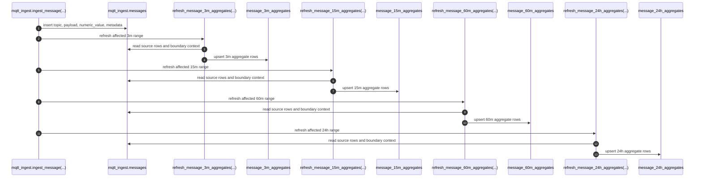
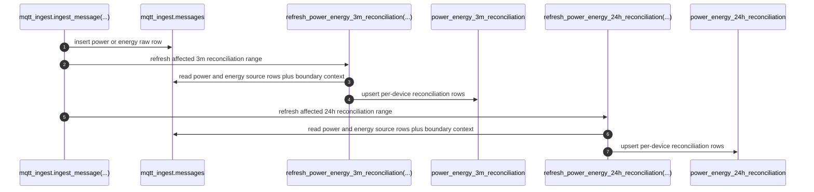
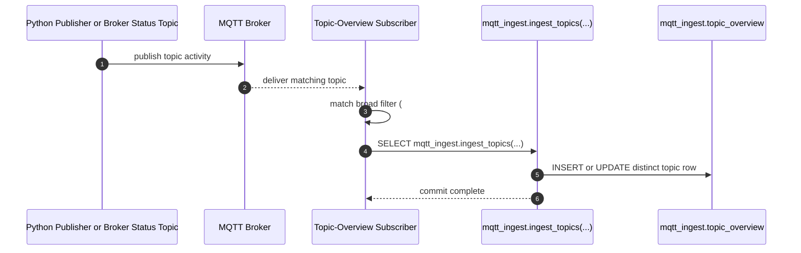
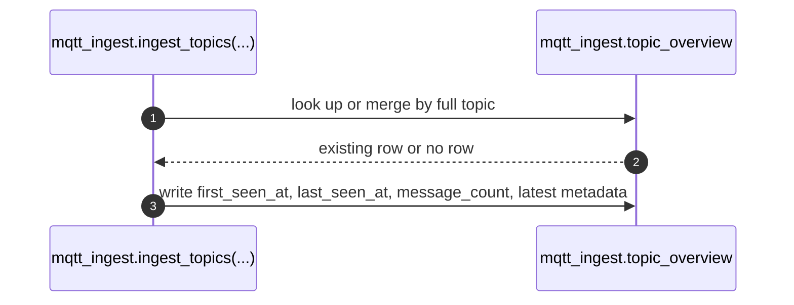

# System Architecture

This document explains the structural model behind the local MQTT-to-Postgres bench.

It focuses on:

- the Python publisher and Python subscriber apps
- the MQTT broker as the transport boundary
- the Postgres/TimescaleDB database as the persistence and derivation boundary
- the two ingest functions:
  - `mqtt_ingest.ingest_message(...)`
  - `mqtt_ingest.ingest_topics(...)`

## Component Model

The repo has two canonical Python app packages:

- `apps.publisher`: synthetic MQTT publishers and aggregate-driven twin-config generation
- `apps.subscriber`: MQTT subscriber runtime that forwards messages into database ingest functions

Shared packages:

- `broker.subscriber`: shared MQTT subscriber client helpers
- `observability`: runtime logging and trace payload helpers
- `mqtt2postgres`: package metadata and the subscriber module entrypoint bridge

## Main Runtime Chain

At runtime, the primary chain is:

1. a Python publisher app generates payloads
2. the MQTT broker accepts and distributes the published message
3. a Python subscriber app receives the matching topic
4. the subscriber calls one database ingest function
5. the database persists raw or topic-overview state
6. aggregate refresh functions derive retained summary tables when the ingest path is `ingest_message(...)`

## Docker Container Overview

The default local stack runs as five cooperating containers:

- one publisher container
- one Mosquitto broker container
- two subscriber containers with different settings files and different ingest functions
- one TimescaleDB container

## Mermaid Class Diagram: Docker Containers

## Container Responsibility Notes

- `mqtt-publisher` is stateless apart from its mounted publisher settings file.
- `mqtt-broker` is only the MQTT routing boundary; it does not persist the analytical model.
- `mqtt-subscriber` is the sensor-ingest process and is responsible for raw message persistence and aggregate refresh through `mqtt_ingest.ingest_message(...)`.
- `mqtt-subscriber-topics` is the topic-inventory process and is responsible for broker visibility through `mqtt_ingest.ingest_topics(...)`.
- `timescaledb` owns both raw persistence and derived aggregate tables.

## Mermaid Class Diagram

## Cardinality Notes

- One publisher settings file can define many publishers.
- One publisher can publish many MQTT topics.
- One broker can distribute a single published message to zero, one, or many subscribers depending on topic matching.
- One subscriber instance is bound to one subscriber settings file at startup.
- One subscriber message callback results in exactly one database-function call for the configured ingest path.
- `mqtt_ingest.ingest_message(...)` inserts one raw row per routed message and may update multiple aggregate rows across multiple bucket widths.
- `mqtt_ingest.ingest_topics(...)` upserts one logical row per distinct topic in `mqtt_ingest.topic_overview`.

## Sequence Diagram: End-To-End Sensor Ingest

This is the normal path for sensor-like topics such as `sensors/node-1/temp`.

## Sequence Diagram: Raw Data To Aggregate Tables

This sub-sequence focuses only on the database side after `mqtt_ingest.ingest_message(...)` has been called.

## Sequence Diagram: Raw Data To Power/Energy Reconciliation Tables

## Sequence Diagram: Topic Inventory Ingest

This is the parallel ingest path used for broker visibility.

## Sequence Diagram: Topic Inventory Table Update

This sub-sequence isolates the database behavior of `mqtt_ingest.ingest_topics(...)`.

## Why The Two Ingest Functions Stay Separate

The split is intentional:

- `mqtt_ingest.ingest_message(...)` is optimized for retained event history and numeric aggregation
- `mqtt_ingest.ingest_topics(...)` is optimized for broker-topic discovery and last-seen state

If they were collapsed into a single ingest function, the runtime would mix two different persistence models:

- append-heavy time-series event storage
- per-topic upsert-style inventory tracking

That would make both the Python app configuration and the SQL behavior less explicit.

The power/energy reconciliation path is kept separate from the generic aggregate tables for the same reason. It is a metric-pair specific derivation with its own semantics:

- cumulative counter deltas on the `energy` side
- time integration on the `power` side
- explicit drift calculations between the two

## Reading The System From Left To Right

When explaining the system to another engineer, the cleanest order is:

1. publisher settings create one or more synthetic publisher clients
2. the MQTT broker is only the transport fan-out boundary
3. the subscriber chooses one ingest function per process
4. the database function owns the persistence semantics
5. aggregate tables are derived artifacts of `mqtt_ingest.messages`, not peer sources
