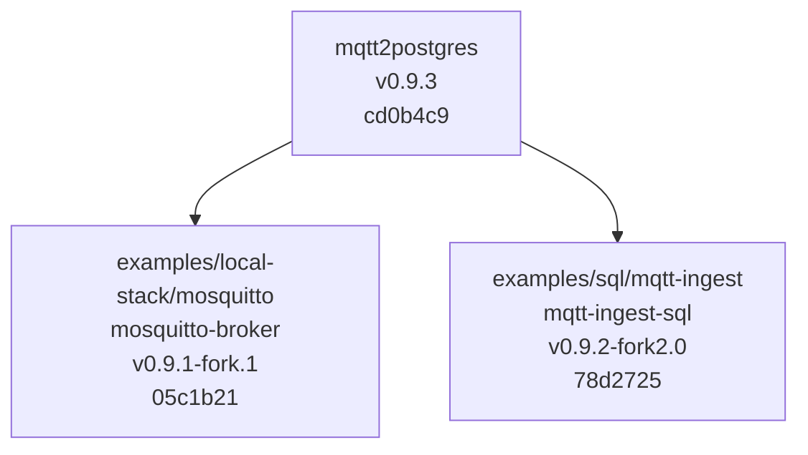

# Versioning

Package versions are derived from Git tags via `setuptools-scm`.

## Baseline Diagram

The current repository baseline is:



Use release tags such as:

```text
v0.2.0
v0.2.1
```

In GitHub Actions, make sure checkout fetches tags:

```yaml
fetch-depth: 0
```

The `fallback_version` in `pyproject.toml` is only used when Git tag metadata is unavailable.
